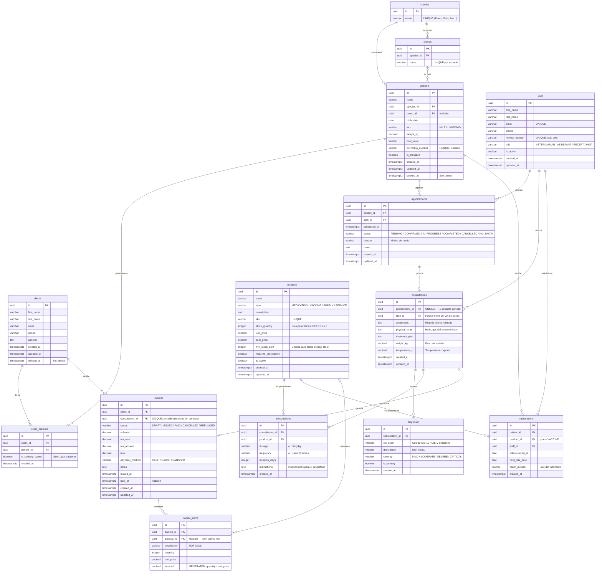

# Diagram viewer

```mermaid
erDiagram

    %% ─── CLIENTES Y PACIENTES ───────────────────────────────────────────────────

    clients {
        uuid        id              PK
        varchar     first_name
        varchar     last_name
        varchar     email
        varchar     phone
        text        address
        timestamptz created_at
        timestamptz updated_at
        timestamptz deleted_at      "Soft delete"
    }

    patients {
        uuid        id              PK
        varchar     name
        uuid        species_id      FK
        uuid        breed_id        FK  "nullable"
        date        birth_date
        varchar     sex             "M / F / UNKNOWN"
        decimal     weight_kg
        varchar     coat_color
        varchar     microchip_number "UNIQUE, nullable"
        boolean     is_sterilized
        timestamptz created_at
        timestamptz updated_at
        timestamptz deleted_at      "Soft delete"
    }

    client_patients {
        uuid        id              PK
        uuid        client_id       FK
        uuid        patient_id      FK
        boolean     is_primary_owner "Solo 1 por paciente"
        timestamptz created_at
    }

    %% ─── CATÁLOGOS ──────────────────────────────────────────────────────────────

    species {
        uuid    id   PK
        varchar name "UNIQUE (Perro, Gato, Ave...)"
    }

    breeds {
        uuid    id         PK
        uuid    species_id FK
        varchar name       "UNIQUE por especie"
    }

    %% ─── PERSONAL ────────────────────────────────────────────────────────────────

    staff {
        uuid        id              PK
        varchar     first_name
        varchar     last_name
        varchar     email           "UNIQUE"
        varchar     phone
        varchar     license_number  "UNIQUE, solo vets"
        varchar     role            "VETERINARIAN / ASSISTANT / RECEPTIONIST"
        boolean     is_active
        timestamptz created_at
        timestamptz updated_at
    }

    %% ─── AGENDA Y CONSULTAS ─────────────────────────────────────────────────────

    appointments {
        uuid        id              PK
        uuid        patient_id      FK
        uuid        staff_id        FK
        timestamptz scheduled_at
        varchar     status          "PENDING / CONFIRMED / IN_PROGRESS / COMPLETED / CANCELLED / NO_SHOW"
        varchar     reason          "Motivo de la cita"
        text        notes
        timestamptz created_at
        timestamptz updated_at
    }

    consultations {
        uuid        id              PK
        uuid        appointment_id  FK  "UNIQUE — 1 consulta por cita"
        uuid        staff_id        FK  "Puede diferir del vet de la cita"
        text        anamnesis       "Historia clínica relatada"
        text        physical_exam   "Hallazgos del examen físico"
        text        treatment_plan
        decimal     weight_kg       "Peso en la visita"
        decimal     temperature_c   "Temperatura corporal"
        timestamptz created_at
        timestamptz updated_at
    }

    diagnoses {
        uuid        id               PK
        uuid        consultation_id  FK
        varchar     cie_code         "Código CIE-10 / CIE-V (nullable)"
        varchar     description      "NOT NULL"
        varchar     severity         "MILD / MODERATE / SEVERE / CRITICAL"
        boolean     is_primary
        timestamptz created_at
    }

    %% ─── INVENTARIO Y PRODUCTOS ─────────────────────────────────────────────────

    products {
        uuid        id              PK
        varchar     name
        varchar     type            "MEDICATION / VACCINE / SUPPLY / SERVICE"
        text        description
        varchar     sku             "UNIQUE"
        integer     stock_quantity  "Solo para físicos; CHECK >= 0"
        decimal     unit_price
        decimal     cost_price
        integer     min_stock_alert "Umbral para alerta de bajo stock"
        boolean     requires_prescription
        boolean     is_active
        timestamptz created_at
        timestamptz updated_at
    }

    %% ─── PRESCRIPCIONES Y VACUNAS ───────────────────────────────────────────────

    prescriptions {
        uuid        id              PK
        uuid        consultation_id FK
        uuid        product_id      FK
        varchar     dosage          "ej: '5mg/kg'"
        varchar     frequency       "ej: 'cada 12 horas'"
        integer     duration_days
        text        instructions    "Instrucciones para el propietario"
        timestamptz created_at
    }

    vaccinations {
        uuid        id              PK
        uuid        patient_id      FK
        uuid        product_id      FK  "type = VACCINE"
        uuid        staff_id        FK
        date        administered_at
        date        next_due_date
        varchar     batch_number    "Lote del fabricante"
        timestamptz created_at
    }

    %% ─── FACTURACIÓN ─────────────────────────────────────────────────────────────

    invoices {
        uuid        id              PK
        uuid        client_id       FK
        uuid        consultation_id FK  "UNIQUE, nullable (servicios sin consulta)"
        varchar     status          "DRAFT / ISSUED / PAID / CANCELLED / REFUNDED"
        decimal     subtotal
        decimal     tax_rate
        decimal     tax_amount
        decimal     total
        varchar     payment_method  "CASH / CARD / TRANSFER"
        text        notes
        timestamptz issued_at
        timestamptz paid_at         "nullable"
        timestamptz created_at
        timestamptz updated_at
    }

    invoice_items {
        uuid        id              PK
        uuid        invoice_id      FK
        uuid        product_id      FK  "nullable — ítem libre si null"
        varchar     description     "NOT NULL"
        integer     quantity
        decimal     unit_price
        decimal     subtotal        "GENERATED: quantity * unit_price"
    }

    %% ─── RELACIONES ─────────────────────────────────────────────────────────────

    clients         ||--o{    client_patients  : "tiene"
    patients        ||--o{    client_patients  : "pertenece a"

    species         ||--o{    patients         : "es especie"
    species         ||--o{    breeds           : "tiene raza"
    breeds          |o--o{    patients         : "es raza"

    patients        ||--o{    appointments     : "agenda"
    staff           ||--o{    appointments     : "atiende"
    appointments    ||--o|    consultations    : "genera"

    consultations   ||--o{    diagnoses        : "incluye"
    consultations   ||--o{    prescriptions    : "prescribe"
    staff           ||--o{    consultations    : "realiza"

    products        ||--o{    prescriptions    : "es prescrito en"
    products        ||--o{    vaccinations     : "es aplicado en"

    patients        ||--o{    vaccinations     : "recibe"
    staff           ||--o{    vaccinations     : "administra"

    clients         ||--o{    invoices         : "recibe"
    consultations   ||--o|    invoices         : "genera"
    invoices        ||--o{    invoice_items    : "contiene"
    products        |o--o{    invoice_items    : "referencia"
```